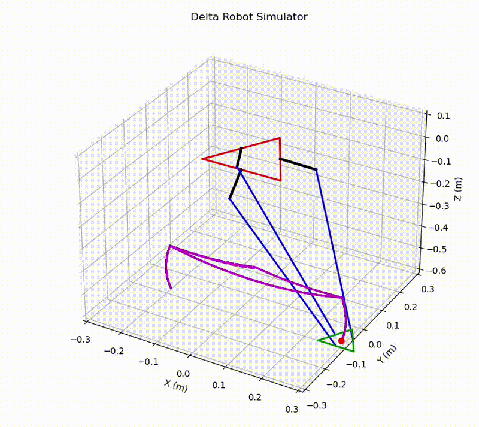

# Delta Robot

A ROS 2-based delta robot for high-speed pick-and-place applications.

## 🎥 Demo

<p align="center">
  
</p>


## 📖 Overview

This repository contains the complete software and hardware interface for a 3-DOF Delta Robot built using **ROS 2 Humble**. The project provides robot visualization, kinematic calculations, hardware communication, and Arduino firmware for controlling the robot.

The robot is intended for high-speed pick-and-place tasks and serves as a modular platform for learning and experimentation with robotic manipulators.

### Features

- ROS 2 Humble packages
- URDF robot description
- RViz visualization
- Forward kinematics
- Inverse kinematics
- Arduino-based motor control
- Hardware interface package
- Workspace simulation

---
## 🔧 Hardware

The Delta Robot is driven by three stepper motors and uses:

- **3 Stepper Motors** for robot actuation.
- **Vacuum Pump** for object gripping.
- **IR Sensor** to detect whether an object has been successfully picked before continuing the task.
- **Arduino** to control the motors, pump, and sensors.

## 🤖 Arduino Firmware

The`arduino_codes` directory contains the firmware used to control the robot hardware.

### Files

- **pump_home_delta.ino**
  - Main firmware used during operation.
  - Controls the three stepper motors.
  - Executes the received trajectory.
  - Controls the vacuum pump.
  - Performs the homing procedure.


- **test_dir.ino**
  - Utility sketch used to verify the rotation direction of each stepper motor before running the complete system.
 
## ⚙️ Motion Control

The robot uses **ROS 2 Control** to generate motion trajectories.

The generated trajectory points are sent to the Arduino, which drives the three stepper motors while coordinating the vacuum pump during the pick-and-place task.

## 📐 Kinematics

The `kinematics` package contains:

- Forward Kinematics
- Inverse Kinematics
- Workspace Simulation
- Robot Client
- Pump Client

### Configuration

Before using the kinematics scripts, replace the robot dimensions inside:

- `Inverse_kinematics.py`
- `forword_k.py`

with the dimensions of your own Delta Robot.

These values include the robot geometry such as arm lengths and platform dimensions.

## 🖥️ Workspace Simulation

The repository includes a workspace simulator that can be used to verify trajectories before sending them to the physical robot.

### Steps

 Run the python file in Delta-Robot/src/kinematics/kinematics/workspace.py

 <p align="center">
  
</p>

## 🚀 Getting Started

### Prerequisites
- Ubuntu 22.04
- ROS 2 Humble
- Arduino IDE (or `arduino-cli`)
- Python 3.10+
- `colcon` build tools

### 1. Clone the Repository
```bash
mkdir -p ~/delta_ws/src
cd ~/delta_ws/src
git clone https://github.com/<your-username>/Delta-Robot.git .
```

### 2. Install Dependencies
```bash
cd ~/delta_ws
rosdep install --from-paths src --ignore-src -r -y
```

### 3. Build the Workspace
```bash
colcon build
source install/setup.bash
```

### 4. Flash the Arduino Firmware
- Open `arduino_codes/pump_home_delta.ino` in the Arduino IDE.
- Select the correct board and port (e.g. `/dev/ttyUSB0`).
- Upload the firmware to the Arduino.
- *(Optional)* Run `test_dir.ino` first to confirm stepper motor directions before running the full system.

### 5. Configure Robot Dimensions
Update your robot's geometry (arm lengths, platform dimensions) in:
- `src/kinematics/kinematics/Inverse_kinematics.py`
- `src/kinematics/kinematics/forword_k.py`

### 6. Launch the Robot
```bash
ros2 launch main_delta_bringup display.launch.xml
```

### 7. Run the Workspace Simulation (optional)
Verify trajectories before sending them to the physical robot:
```bash
python3 src/kinematics/kinematics/workspace.py
```

### 8. Start a Pick-and-Place Task
Run the robot client to send commands to the hardware interface:
```bash
ros2 run kinematics pump_client
```

